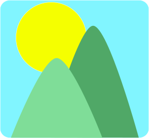
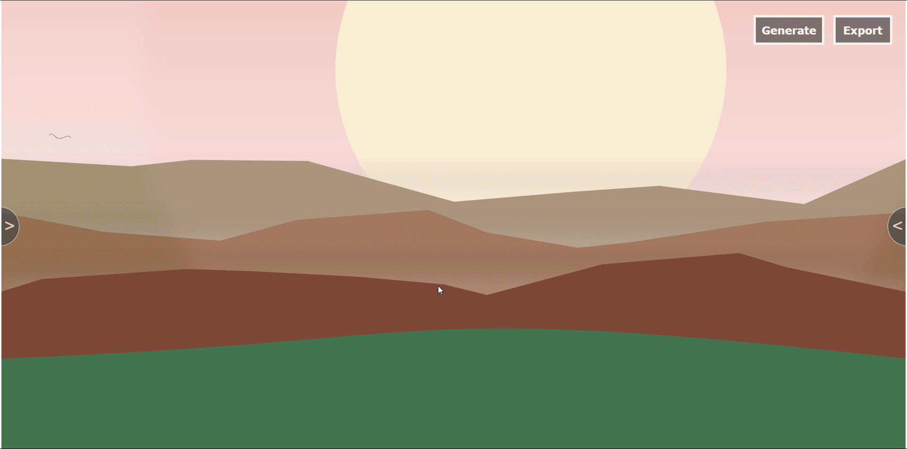

# Landscape Generator
<p align="center">

</p>
## About

Landscape Generator is An open Source web application that generates landscape drawings randomly, then gives you the ability to edit it and export it as SVG or PNG.

## Usage

##### Web development

You can download this repository and integrate the script *LandscapeGenerator.js* in your html .

```html
<script src="LandscapeGenerator.js"></script>
```

Or use the minified version situated under *Minified* folder

```html
<script src="LandscapeGenerator.min.js"></script>
```

then use the following function in your main javascript file

```js
const LG = generateLandscape(SVGelement, width, height, options);
```

The function return LandscapeGenerator object.

***SVGelement :*** (dom element) (require) the dom element where the svg will be displayed **it must be a svg element**.

***width:*** (number) (optional) the width of the svg , by default take the width of the parent element.

***height:*** (number) (optional) the height of the svg, by default take the height of the parent element.

***options:*** (object) (optional) modify the default properties of the generation, these properties are detailed further down.

After the previous function you can use this function to  generate again a new landscape  :

```js
LG.generate()
```

 You can also change the default values with the function set() example :

```js
LG.set({
    option1 : newValue,
    option2 : newValue
})
```

then when you will generate again it will take the new values.

##### Game Development

You can use the web application in the itch.io page:point_right: [ Landscape Generator itch.io](https://westboy.itch.io/landscape-generator) 
<p align="center">

</p>
exported images can be used as background for 2d games (platform, arcade...). If desired, they are generated in such a way that they can be used as vertically repeating textures (disable sun and sunshine).

You can also export the whole scene as separate layers (useful for the parallax effect).

You can also edit the generated scene with the left panel. 

## Values and parameters of generation

You can change variable of the generation with both set() function and the right panel of the web application 

**Boolean Variables :**

All the following booleans if they are true the they will be generated in the scene, and if  they are false they will not 

- fogBool 

- sunBool

- sunshineBool

- mountainsBool

- plainsBool 

**Random Variables :**

When the generation starts, all variables take a random value between a minimum and maximum.

| Variable in Editor     | Variable in javascript |
| ---------------------- | ---------------------- |
| Mountain Width         | mountainWidth          |
| Mountain Height        | mountainHeight         |
| Horizon Y              | horizonY               |
| Mountains Range Number | mountainsRangeNumber   |
| Mountain Space         | mountainSpace          |
| Sun Position X         | sunPositionX           |
| Sun Position Y         | sunPositionY           |
| Sun Radius             | sunRadius              |
| Birds Number           | birdsNumber            |
| Plains Number          | plainsNumber           |
| Plains Height          | plainsHeight           |

If you want to change the look of your landscape you have to change the min and max variable.

The format of variable name are the same :point_right: minVariableName < variableName < maxVariableName (in the editor Variable Name start with capitals and are separated by space)

example change min and max variable with set() function

```js
LG.set({
    minMountainWidth : 100,
    maMountainnWidth : 300,
    minBirdsNumber: 0,
    maxBirdsNumber: 10
})
```

*Note : if you want to have a fix value for a variable you just have to set the same number for the max and the min*

**Variables and their representation in the scene :**


## Contribution

All contributions are welcome, take a look at the todolist

## TodoList

###### LandscapeGenerator.js :

- Add cloud

- Add trees (different kinds)

- Add other kind of mountain triangle where the peak is rounded 

###### LandscapeEdition.js :

- Load and export presets in json file for generation

## Support the project

If you find the project interesting and useful I would be really grateful if you support me on :[ itch.io](https://westboy.itch.io/landscape-generator) .

## External libraries

The *landscapeGenerator.js* has no dependencies, the web application uses some external libraries :

- **[iro.js](https://github.com/jaames/iro.js)** for color picker0

- **[dragscroll.js](https://github.com/asvd/dragscroll)** for drag scroll. 

- **[saveSvgAsPng.js](https://github.com/exupero/saveSvgAsPng)** to save svg as PNG.

- **[jszip.js](https://github.com/Stuk/jszip)** to downloads layers in zip file.
